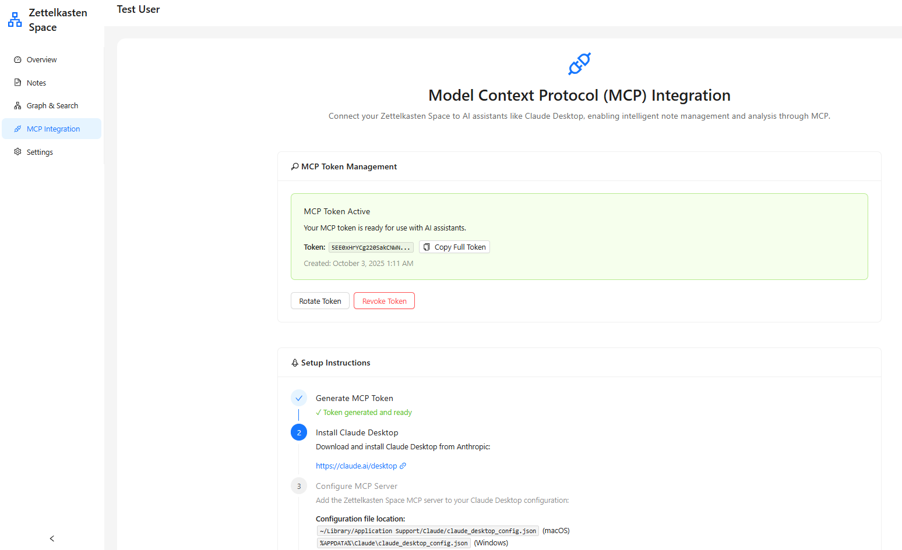

# 🤖 Model Context Protocol (MCP) Integration

> **Revolutionizing AI-Human Knowledge Collaboration**  
> *How Zettelkasten Space bridges human creativity with AI intelligence through seamless integration*

---

## 🎯 **MCP Integration Overview**

The Model Context Protocol (MCP) integration transforms Zettelkasten Space from a traditional note-taking app into an intelligent knowledge partner. By connecting directly with Claude Desktop, users can leverage their entire knowledge base through natural language interactions, making AI assistance contextual, personal, and incredibly powerful.

### 🌟 **The Magic of Context**

Traditional AI interactions lack context—they don't know your previous thoughts, your current projects, or your knowledge patterns. Our MCP integration changes this by giving Claude direct access to your personal knowledge base, creating a truly personalized AI assistant that grows smarter as your knowledge grows.

---

## 🔧 **Technical Architecture**


### **Authentication & Security**


*Screenshot placeholder: MCP authentication and token management interface*

#### 🔐 **Secure Token Management**
- **Rotating Tokens**: Automatic token rotation for enhanced security
- **Scoped Permissions**: Fine-grained access control per functionality
- **Audit Trail**: Complete logging of AI interactions with your data
- **User Control**: Easy token revocation and regeneration


### **Real-Time Synchronization**

The MCP integration maintains live synchronization between your knowledge base and Claude's context, ensuring AI responses are always based on your most current thinking.

---

## 🎨 **User Experience Design**

### **Seamless Setup Process**


*Screenshot placeholder: Step-by-step MCP configuration wizard*

#### 📋 **One-Time Configuration**
1. **Token Generation**: Single-click MCP token creation
2. **Claude Configuration**: Copy-paste setup for Claude Desktop
3. **Verification**: Automatic connection testing
4. **Ready to Use**: Immediate AI access to your knowledge base

#### 💬 **Natural Language Interactions**

**Example Conversations:**

```
👤 User: "Find notes about machine learning ethics and create a summary"

🤖 Claude: I found 12 notes in your knowledge base about machine learning ethics. 
Here's a comprehensive summary based on your research:

**Key Themes from Your Notes:**
1. Bias in Training Data (5 notes)
   - Connected to your work on "Algorithmic Fairness" 
   - Links to "Historical Bias in AI Systems"

2. Transparency and Explainability (4 notes)
   - Your note "Black Box Problem" connects to regulation discussions
   - Related to "GDPR and AI Rights" from your legal research

3. Societal Impact (3 notes)
   - Links to your "Future of Work" collection
   - Connected to "Digital Divide" research

Would you like me to create a new synthesis note connecting these themes?
```

```
👤 User: "What connections exist between my quantum computing notes and cryptography research?"

🤖 Claude: I've analyzed the connections in your knowledge base and found 
several fascinating links between your quantum computing and cryptography work:

**Direct Connections:**
• "Post-Quantum Cryptography" ↔ "Quantum Key Distribution"
• "Shor's Algorithm" ↔ "RSA Vulnerability Analysis"
• "Quantum Supremacy" ↔ "Cryptographic Timeline"

**Emerging Patterns:**
Your notes show evolution from theoretical concern (2022 notes) to 
practical implementation planning (recent notes). 

**Suggested New Connection:**
Your "Quantum Error Correction" note could link to "Cryptographic 
Reliability Standards" - both deal with fault tolerance in critical systems.

Shall I create this connection and explain the relationship?
```

---

## 🌟 **Advanced MCP Capabilities**

### 🔍 **Intelligent Knowledge Discovery**

#### **Contextual Search**
![MCP Contextual Search]
*Screenshot placeholder: AI-powered contextual search results*

Unlike traditional keyword search, MCP-powered discovery understands the semantic meaning and connections within your knowledge base:

- **Concept-Based Queries**: Find related ideas even without exact keyword matches
- **Cross-Domain Connections**: Discover unexpected links between different fields
- **Temporal Patterns**: Understand how your thinking has evolved over time
- **Gap Analysis**: Identify areas where additional research might be valuable

### 📝 **AI-Enhanced Content Creation**

#### **Intelligent Note Expansion**
![MCP Content Enhancement]
*Screenshot placeholder: AI-assisted note creation and expansion*

The MCP integration doesn't just help you find existing knowledge—it helps you create new insights:

**Content Enhancement Features:**
- **Concept Elaboration**: Expand brief notes with structured detail
- **Citation Integration**: Connect ideas to your existing research
- **Argument Development**: Build logical progressions from scattered thoughts
- **Cross-Pollination**: Apply insights from one domain to another

**Example Workflow:**
```
1. User creates rough note: "Blockchain governance models"
2. MCP analyzes existing related notes
3. AI suggests structure based on user's research patterns
4. Proposes connections to political science and organizational theory notes
5. Offers to expand with specific examples from user's case study collection
```

### 📊 **Knowledge Analytics & Insights**

#### **AI-Powered Pattern Recognition**
![MCP Analytics]
*Screenshot placeholder: AI-generated insights and patterns*

The MCP integration provides unprecedented insights into your knowledge patterns:

**Analytical Capabilities:**
- **Research Trajectory Analysis**: Understand your intellectual journey
- **Concept Evolution Tracking**: See how ideas develop over time
- **Influence Mapping**: Identify your most influential sources and ideas
- **Knowledge Gap Detection**: Find areas for further exploration

**Sample AI Insights:**
```
🧠 Knowledge Pattern Analysis

"Your research shows increasing focus on 'distributed systems' over 
the past 6 months, with 73% more notes than the previous period. 

Key Evolution:
• Early focus: Theoretical consensus algorithms
• Current focus: Practical implementation challenges
• Emerging theme: Governance and human factors

Suggested Exploration:
Your 'Byzantine Fault Tolerance' work could connect powerfully with 
your recent 'Organizational Resilience' notes - both deal with 
maintaining integrity despite partial failures."
```

---

## 🎯 **Use Cases & Workflows**

### 🎓 **Academic Research**

#### **Literature Review Acceleration**
```
Researcher Workflow:
1. "Claude, I'm starting research on sustainable urban design. 
   What related concepts do I already have notes on?"

2. AI identifies connections to climate change, urban planning, 
   and environmental policy notes

3. "Create a literature gap analysis based on my existing research"

4. AI generates structured overview with identified research opportunities

5. "Help me create a research proposal outline that builds on my existing work"
```

### 💡 **Creative Synthesis**

#### **Cross-Domain Innovation**
```
Innovation Workflow:
1. "Find unexpected connections between my biology and architecture notes"

2. AI discovers biomimicry patterns in user's scattered observations

3. "Develop these connections into a structured framework"

4. AI creates synthesis note with formal concept development

5. "Generate research questions for further exploration"
```

### 📚 **Knowledge Curation**

#### **Intelligent Collection Building**
```
Curation Workflow:
1. "Create a comprehensive collection on 'decision-making frameworks'"

2. AI scans entire knowledge base for relevant notes

3. Identifies notes from psychology, business, philosophy, and personal experience

4. "Organize these into a learning pathway for a colleague"

5. AI structures collection with progressive complexity and clear connections
```

---

## 🔧 **Configuration & Customization**

### ⚙️ **MCP Settings Interface**


*Screenshot placeholder: MCP configuration and customization interface*

#### **Customizable AI Behavior**
- **Response Style**: Adjust AI communication preferences
- **Context Depth**: Control how much historical context to include
- **Suggestion Frequency**: Tune proactive recommendation frequency
- **Privacy Levels**: Configure which note categories to include/exclude

#### **Integration Options**
```json
{
  "mcp_preferences": {
    "search_scope": ["active_notes", "archived_notes"],
    "excluded_tags": ["private", "draft"],
    "max_context_notes": 50,
    "suggestion_threshold": 0.6,
    "response_style": "detailed",
    "proactive_insights": true
  }
}
```

### 🔒 **Privacy & Control**

#### **Granular Permissions**
- **Note-Level Control**: Include/exclude specific notes from AI context
- **Tag-Based Filtering**: Use tags to control AI access to sensitive information
- **Time-Based Restrictions**: Limit AI to notes from specific time periods
- **Export Control**: Prevent AI from suggesting external sharing of sensitive content

---

## 📈 **Performance & Scalability**

### ⚡ **Optimized Response Times**


#### **Scalable Architecture**
- **Async Processing**: Non-blocking MCP operations
- **Context Optimization**: Intelligent selection of relevant notes
- **Batch Operations**: Efficient bulk data processing
- **Resource Management**: Smart memory and compute allocation

### 📊 **Usage Analytics**

Track MCP integration effectiveness:
- **Query Success Rate**: Measure AI's ability to find relevant information
- **User Satisfaction**: Track positive vs. negative interactions
- **Context Utilization**: Monitor how effectively AI uses available context
- **Discovery Rate**: Measure new connections and insights generated

---

## 🚀 **Future Enhancements**

### 🔮 **Roadmap Vision**

#### **Advanced AI Capabilities**
- **Multi-Modal Understanding**: Integration with images, PDFs, and audio notes
- **Real-Time Collaboration**: AI-mediated knowledge sharing between users
- **Predictive Insights**: Anticipate research directions based on current patterns
- **Custom AI Agents**: Specialized AI assistants for different knowledge domains

#### **Enhanced Integration**
- **Voice Interface**: Natural language interaction through speech
- **Mobile MCP**: Full MCP capabilities on mobile devices
- **Third-Party Tools**: Integration with research tools, reference managers, and writing apps
- **Collaborative AI**: Team-based knowledge exploration with AI facilitation

---

## 🎉 **Success Stories**

### 📖 **Real User Experiences**

> *"The MCP integration transformed how I conduct literature reviews. Instead of manually searching through hundreds of notes, I can ask Claude to find patterns and connections I never would have discovered. It's like having a research assistant who knows my work better than I do."*  
> — Dr. Sarah Chen, Cognitive Science Researcher

> *"I use the MCP integration for creative writing. Claude helps me find unexpected connections between character ideas, plot elements, and research notes. It's accelerated my ideation process tremendously."*  
> — Marcus Rodriguez, Science Fiction Author

> *"As a consultant, I need to quickly synthesize insights across different client projects. The MCP integration lets me ask Claude to find patterns across my entire knowledge base and generate fresh perspectives for new challenges."*  
> — Jennifer Park, Strategy Consultant

---

## 🏁 **Getting Started with MCP**

### 🚀 **Quick Start Guide**

1. **Generate MCP Token**: Visit `/mcp` in your Zettelkasten Space dashboard
2. **Configure Claude Desktop**: Add the provided configuration to your Claude settings
3. **Test Connection**: Use Claude to search your notes and verify integration
4. **Explore Capabilities**: Try different types of queries and discover what's possible
5. **Customize Experience**: Adjust settings to match your workflow preferences

### 📚 **Learning Resources**

- **Video Tutorials**: Step-by-step setup and usage guides
- **Use Case Examples**: Detailed workflows for different professions
- **Best Practices**: Tips for maximizing MCP integration value
- **Troubleshooting**: Common issues and solutions
- **Community Examples**: Shared configurations and creative use cases

---

## 💡 **Innovation Impact**

The MCP integration represents a fundamental shift in how we interact with our knowledge:

### 🧠 **Cognitive Enhancement**
- **Augmented Memory**: AI helps recall and connect distant ideas
- **Pattern Recognition**: Discover insights hidden in complex information
- **Creative Synthesis**: Generate new ideas through AI-facilitated connections
- **Decision Support**: Access relevant knowledge exactly when needed

### 🔬 **Research Acceleration**
- **Literature Discovery**: Find relevant research across your entire knowledge base
- **Gap Identification**: Identify unexplored areas and research opportunities
- **Hypothesis Generation**: AI suggests testable ideas based on your research
- **Synthesis Automation**: Generate structured summaries and frameworks

### 🎯 **Personal Productivity**
- **Context Switching**: Quickly access relevant knowledge for any task
- **Knowledge Leverage**: Apply insights from one project to another
- **Learning Acceleration**: Build on existing knowledge more effectively
- **Insight Capture**: Never lose a good idea or connection again

---

*The Model Context Protocol integration transforms Zettelkasten Space from a note-taking tool into an intelligent knowledge partner, amplifying human creativity and insight through seamless AI collaboration.*

---

## 📋 **MCP Integration Checklist**

### ✅ **Setup Requirements**
- [ ] Active Zettelkasten Space account
- [ ] Claude Desktop application installed
- [ ] MCP token generated and configured
- [ ] Connection tested and verified
- [ ] Privacy settings configured

### 🎯 **Optimization Tips**
- [ ] Tag system established for content organization
- [ ] Privacy preferences set for sensitive content
- [ ] Regular note-taking habits developed
- [ ] Link creation patterns established
- [ ] Analytics reviewed for usage insights

---

*Ready to experience the future of AI-enhanced knowledge work? Your intelligent knowledge partner awaits.*